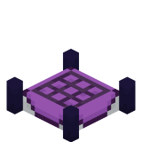
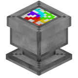

# Crafters

## General info:

* the crafters are crafted in the Crafting Table

## Spell Crafter

<figure><figcaption></figcaption></figure>

### Can Craft:

* PFE spells
* Empty Vial
* [Spell Pottery sherd](../pottery-sherds/)
* Magic 8 Ball

## Dye Un-mixer

<figure><figcaption></figcaption></figure>

* Unmixes all dyes into the dyes it can be crafted from (will give all that were used to craft it back even though it only shows one)
