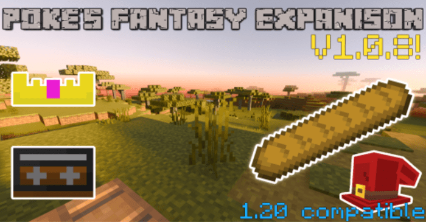

# v1.0.8

##

<figure><figcaption></figcaption></figure>

## ITEMS&#x20;

* Added Cassettes (They Listen & Galactic March)&#x20;
* Added Warp Gem&#x20;
* Rings no longer have an enchantment glint&#x20;
* Retextured the Springy Ringy&#x20;
* Retextured the Dragon Ring&#x20;
* Retextured the Golden Gem Holder&#x20;
* Retextured the Diamond Gem Holder&#x20;
* Adjusted the categories that the items appear in&#x20;
* Retextured the Cobalt ingot to make it more blue&#x20;
* Added a texture to the Quantum Teleporter&#x20;
* Added baguette&#x20;
* Added lore text to the Knightling helmet when acquired by killing the Knightling&#x20;
* Retextured Shade Ingot&#x20;
* Retextured Shade Nugget&#x20;
* Retextured Raw Shade&#x20;
* Stone Upgrader can now convert Cobbled Limestone into Limestone&#x20;
* Stone Upgrader can now upgrade Limestone into Limestone Bricks

## ARMOR&#x20;

* Retextured the Godly Chestplate icon&#x20;
* Retextured the Godly Leggings icon&#x20;
* Retextured the Godly Boots icon&#x20;
* Armor Effects are given less Frequently to help improve performance&#x20;
  * Note: The Armor effects are now controlled by Scripts so there is a chance it can break in the coming updates \[Works as of 1.20]
* Renamed Stone armor to Cobblestone armor&#x20;
* Retextured Cobblestone armor&#x20;
* Cobblestone armor is no longer a WIP&#x20;
* Added Crown (WIP)
* Cactus armor will now deal damage to non-player entities as well&#x20;
* Retextured Shade armor & Icons
* Shade Armor is no longer a WIP

## ORES/BLOCKS&#x20;

* Retextured the Nebula Ore&#x20;
* Retextured the Nebula Block&#x20;
* Added Limestone Bricks&#x20;
* Added Limestone Brick Slabs&#x20;
* Added Limestone Brick Post

## MOBS&#x20;

* Adjusted the listener spawn egg texture&#x20;
* Retextured the Shopkeeper's spawn egg&#x20;
* Renamed the Shopkeeper&#x20;
* Retextured the Shopkeeper&#x20;
* Shopkeeper is no longer a WIP&#x20;
* Lowered the spawn rate of the Demonic Allay

## STRUCTURES&#x20;

* Added the Ruined Tower

## Music/Audio/Text

* Added Galactic March&#x20;
* Shortened "They Listen" track to reduce storage size&#x20;
* The volume of the track "They Listen" is now controlled by the Sound slider in audio settings when fighting the Listener Boss&#x20;
* Updated the language files

## Recipes&#x20;

* Wooden Haxels can now be crafted with Bamboo and Cherry Logs&#x20;
* Shade Gem now requires the Warp Ring to craft

## BUG FIXES&#x20;

* Fixed the Galaxy arrow's item name
* Haxels can now break all blocks&#x20;
* Fixed an issue when summoning the Furnace Golem it would spit out content log errors&#x20;
* Fixed an issue when summoning the Shopkeeper it would spit out a content log error&#x20;
* Fixed an issue where cactus armor would crash the game
