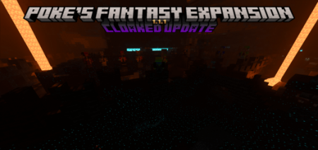

---
layout:
  title:
    visible: true
  description:
    visible: true
  tableOfContents:
    visible: true
  outline:
    visible: true
  pagination:
    visible: true
---

# v1.1.1

<figure><figcaption></figcaption></figure>

## o/

It's time for another update! this update includes a ton of balancing changes and some new robes to check out!

## Things in WIP

* Raccoon
* Redstone Golem
* Raw Ore Blocks
* Astral Armor
* Molten Armor
* Death Armor
* Medic Armor
* Wasted Armor
* Goggles Cosmetic
* Phantomic Conduit
* Lava Sponge
* Necromancer

## **Items**

* Added Obsidian Depressor
* Added Shadow Ring
  * will grant invisibility when used
* Added Shadow Gem
* Added Empty Cassette
* Added Cassette || C418 - Wait
* Added Cassette || C418 - 13
* Added Cassette || C418 - 11
* Added Cassette || C418 - Ward
* Added Cassette || C418 - Strad
* Added Cassette || C418 - Stal
* Added Cassette || C418 - Mellohi
* Added Cassette || C418 - Far
* Added Cassette || C418 - Chrip
* Added Cassette || C418 - Blocks
* Added Cassette || C418 - Cat
* Added Cassette || C418 - Mall
* Added Cassette || Lena Raine - Pigstep
* Added Cassette || Samuel Åberg - 5
* Added Cassette || Lena Raine - Otherside
* Added Cassette || Aaron Cherof - Relic
* Cassettes no longer have enchantment glint
* Red Button will now stop all active audio when used
* Cassette || They Listen identifier was changed
  * you will need to craft it into the new version
* Nebula Magnets no longer stacks
* Item Magnets no longer stacks
* Galaxy arrows now do more damage \[25->35]
* Arrow ring now has more Durability \[450->500]
* Astral Nugget now has a texture
* Zeus Ring will no longer strike:
  * Arrow
  * Armor Stand
  * Boat
  * Chest Boat
  * Minecart
  * Hopper Minecart
  * Chest Minecart
  * Command Block Minecart
  * Leash Knot
  * NPC
  * Xp Orb
* Renamed Budificator to Amethyst Upgrader

## **Armor**

* Festive helmet can be equipped properly
* Goggles now have a texture
* Cactus Armor now only requires the leggings and boots to receive the set bonus
* Retextured Galaxy Armor
* **Added more robes**
  * Feather
  * Gluttony
  * Hasted
  * Heroic
  * Shadow
  * Springy
  * Swift
  * Cobalt
* **Effect Changes**
  * Holy Armor no longer has slow falling
  * Shade Armor now give resistance 3 rather than resistance 4
  * Shade Armor no longer gives Night Vision
  * Nebula Armor now gives Fire Resistance
  * Nebula Armor now gives Village Hero 3
  * Nebula Armor now gives Strength 2
  * Onyx Armor's Regeneration has been changed \[4->2]
  * Galaxy Armor now gives haste 2

## **Ores/Blocks**

* Retextured Calibrated Cobblestone Generators
* Added End Godly Ore
* Added End Galaxy Ore
* End Godly Ore will no now drop 2-9 Godly nuggets
* End Galaxy Ore will now drop 2-9 Galaxy nuggets
* Astral Ore can now be smelted
* Nether Demonic Ore now uses Netherrack sounds
* Nether Hellish Ore now uses Netherrack sounds
* Nether Onyx Ore now uses Netherrack sounds
* Nether Shade Ore now uses Netherrack sounds
* Lava Sponge will now uses Moss block sounds
* Astral Block now uses Iron sounds
* Cobalt Block now uses Copper sounds
* Calibrated Cobblestone Generators now use Copper Sounds

## **Mobs**

* Shopkeeper will no longer go out of stock
* Zombken now has a different death sound
* Zombken's Death sound can be heard from farther \[20->25]
* Raccoon has a new model/texture
  * animations a a bit buggy for now but will be fixed soon
  * Thanks to O2God for the model!
* Token Trader's Upgrade Core price was adjusted \[Iron->Gold token]
* The Listener will once again play boss music
* Token Trader's health has been reduced \[200->20]
* Shopkeeper's health has been reduced \[200->20]
* **Furnace Golem changes**
  * now has more health \[4250->4500]
  * now does more damage \[6->15]
  * can no longer be leashed or have a balloon attached to it
  * now does more damage when doing slam attack \[5->10]
  * now shakes the camera when preforming the slam attack
  * is now immune to fire
  * will no longer affect wither skeletons with levitation
  * shoots the fireball at a faster speed/power
  * death sound is now heard from farther \[20->30]
  * now has a different death sound
  * will attempt to avoid water when pathfinding
  * when hit it will have a chance to destroy a 9x9x8 area around it
  * can now jump higher
  * drops less copper tokens \[24-48 -> 20-32]
  * has a chance to drop shade blocks
  * has a small chance to drop godly blocks
  * can drop between 2 - 10 iron tokens
  * drops more ore blocks \[15->16]
  * slightly increased the chance to get netherite blocks
* **Knightling Changes**
  * Kinghtling now has a different death sound
  * Knightling's Death sound can be heard from farther \[20->30]
  * Health has been adjusted \[500->750]
  * Will no longer despawn
  * Damage has been adjusted \[20->18]
  * Will now play the Galactic March Track when spawned
  * Now Drops 1-4 Iron Tokens

## **Recipes**

* Holy scythe can now accept Holy ingot when being repaired
* Nether Shade Ore is now smeltable
* Nether Onyx Ore is now smeltable
* Cobalt Edged Glass is now craftable
* Stone upgrader now requires upgrade core rather than Banished star
* Hellish armor now requires 8 blocks rather than one to craft
* Holy armor now requires 8 blocks rather than one to craft
* Amethyst Upgrader now requires a upgrade core to craft
* Shade Upgrader now requires shade blocks rather than Shade Ingots
* Onyx Upgrader now requires Onyx Blocks rather than Onyx Ingots
* Hellish Upgrader now requires Hellish Blocks rather than Hellish Ingots
* Calibrated Cobblestone generators no longer give 2 buckets when crafted
* All Calibrated Cobblestone generators can now be crafted
* All Nuggets can now be crafted
* Ultimate Crafter recipe no longer has a order for the tables
* Godly armor is more expensive to craft
* Demonic armor is more expensive to craft
* Block of Molten embers is now craftable
* Ember Robe now requires Block of Molten Embers to craft

## **Other**

* Armor Effects now take slightly longer to apply \[5s->6s]

## **Bug Fixes**

* Arrow ring now takes durability damage properly again
* Holy arrow recipe shows properly now
* Galaxy Arrow recipe shows properly now
* Ember Robe Chestplate arms show better now
* fixed the Zeus ring not working at all
* Cassettes will no longer play for everyone
* All upgraders now display properly in hand
* Cobalt robe is now repairable with the Cobalt Robe rather than Ember Robe
* Molten slimeball's recipe now shows in crafting table properly
