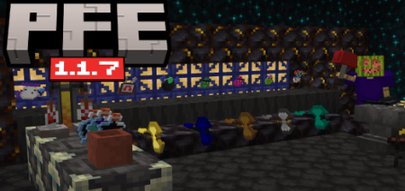

# v1.1.7

Date Released: January 26th, 2024

<figure><figcaption></figcaption></figure>

Its once again time for an update!


[v1.1.5](v1.1.5.md) & [v1.1.6](v1.1.6.md) were merged into this update


### Items:

* Wood Battleaxe is no longer a WIP
* Gold Battleaxe is no longer a WIP
* Cobalt Battleaxe is no longer a WIP
* Shade Battleaxe is no longer a WIP
* Hostile Mob Magnet is no longer a WIP
* Added Death Potion
* Added Radium Ingot
* Added Hellish Haxel
* Added Hellish Soup
* Added Hellish Potion
* Added Demonic Potion
* Added Astral Sword
* Added XP Magnet
* Added Onyx Sword
* Added Cobalt Soup
* Added Cobalt Potion
* Added Milk Bottle
* Added Eggnog
* Added Sugar Water
* Added Hot Coco
* Added Apple juice
* Added Godly Sword
* Added Godly Stick
* Added Sundial
* Added Holy Haxel
* Added Armor Stand Hider
* Added Holy Sword
* Added Boss Event Bounty
  * Sold by the scrapper for 2 iron tokens
* Added Necromancer Staff
* Added Nebula Noodles
* Added Snow Shovel
* Added Cobalt Sword
* Onyx shaft is now held properly
* Nebula stick is now held properly
* Removed Glint on Otherside & 5 cassette

### Armor:

* Added Armadillo Shell
  * Sold by the cosmetic trader for 1 gold token
* Added Top Hat
  * Sold by the cosmetic trader for 1 gold token
* Added Viking Helmet
  * Sold by the cosmetic trader for 1 gold token
* Molten Armor is no longer a WIP
* Radium Armor is no longer a WIP
* Hellish & Holy now give an Armor Progression Fragment when crafting a piece
* Medic armor now gives regen to you and others for longer \[10 -> 20]
* Cactus armor now has more durability \[50 -> 120]

### Ores/Blocks:

* Added Medic Bricks
* Added Molten Bricks
* Added Hellish Bricks
* Added Demonic Bricks
* Added Nebula Bricks
* Added Shade Bricks
* Added Astral Bricks
* Added Holy Bricks
* Added Godly Bricks
* Added Radium Bricks
* Added Void Bricks
* Added Death Bricks
* Added Onyx Bricks
* Added Cobalt Bricks
* Added Galaxy Bricks
* Added Medic Bricks Slab
* Added Molten Bricks Slab
* Added Hellish Bricks Slab
* Added Demonic Bricks Slab
* Added Nebula Bricks Slab
* Added Shade Bricks Slab
* Added Astral Bricks Slab
* Added Holy Bricks Slab
* Added Radium Bricks Slab
* Added Godly Bricks Slab
* Added Limestone Slab
* Added Cut Cobalt Slab
* Added Galaxy Bricks Slab
* Added Cobbled Limestone Slab
* Added Smooth Limestone Slab
* Added Beveled Limestone Slab
* Added Chiseled Cobalt Slab
* Added Cobalt Bricks Slab
* Added Onyx Bricks Slab
* Added Death Bricks Slab
* Added Void Bricks Slab
* Added Block Breaker
* Added Apple Crate
* Added Charged Cobalt Block
* Added Red Present
* Added End Holy Ore
* Added Radium Block
* Added Duster
  * Turns Block Below it from Dirt -> Sand or Cobblestone -> Gravel
* Added Dirter
  * Turns Block Below it from Cobblestone -> Dirt
* Lava Sponge is no longer a WIP
* Removed Raw Ember Block
* Removed Limestone brick slab (Top)
* Removed Crafters
* Nether demonic now has an Ore event
* End Void now has an ore event
* Demonic ore now has a chance to drop 2 raw demonic when broken
* Phantomic Conduit does more damage to phantoms \[5 -> 20]
* Improved slab placement

### Mobs:

* Added Cobalt Golem
* Added Scrapper
* Added Mushroom Buddy
* Raccoon is no longer a WIP
* Removed Penguin
* Removed Redstone Golem
* Removed Backpack
* Removed Cool Pig
* Raccoons now spawn in Taigas
* Demonic Allays now spawn in any Nether biome
* Grizzly Bears now Spawn in Forests
* All traders have been changed with the following
* No longer runs around
* Removed unnecessary behaviors
* Shopkeeper now has sounds
* Money Man now has sounds
* Changed the spawn egg for
  * Necromancer
  * The Listener
  * Token Trader
  * Knightling
  * Shopkeeper
  * Furnace Golem

### Recipes:

* Added a recipe for Gilded Blackstone
* Added a recipe for Rooted Dirt
* Added a recipe for Sponge
* Added a recipe for Reinforced Deepslate
* Added a Recipe for the Heart of the Sea
* Radium Scythe is now craftable
* Making Cut Cobalt in a crafting table now gives more \[4 -> 12]
* You can now uncraft banished stars in the crafting table
* Changed Knightling Recipe to be easier
* Changed the Onyx Haxel recipe.
* Changed Hellish Blade recipe
* Changed the recipe for Nebula Sword
* Changed the recipe for Galaxy bow
* Changed the recipe for Medic & Death Ingots
* Changed the recipe for Void Sword
* Changed the recipe for Demonic, Ember, Galactic, Godly, Hellish, Holy, Nebula, Onyx,
* Shade, Void Scythes
* Adjusted Necromancer recipe.
* Netherite battleaxe now requires the Netherite upgrade template to craft
  * Also, now craftable in a smithing table as well as a crafting table
* Galaxy Upgrader now requires an Onyx Shaft rather than a Stick
* Nebula potion is now crafted in the Brewing stand
* Void Potion is now crafted in the Brewing stand
* Root beer now uses the brewing stand to craft
* Hellish Blades can now be smelted into hellish ingots
* Molten slimeball recipe should now show correctly
* Improved recipe unlocking for:
  * Shopkeeper
  * Token Trader
  * Knightling
  * Empty Cassette
  * Medic Armor
  * Death Armor
  * Demonic Armor
  * Godly Armor
  * Hellish Armor
  * Holy Armor
  * Void Armor
  * Amethyst Armor

### Bug Fixes:

* Charred Poppy now keeps lore text when broken
* Ban Hammer is now held properly in first person
* Haxels/Ban Hammer/Swift Pickaxe can now break:
  * Powered snow
  * Snow
  * Stone double slabs
  * Cherry double slabs
  * Bamboo Sapling
  * Target Block
  * lit varints of blocks
  * lightning rod
  * 1.21 Copper & Tuff blocks
  * All blocks from PFE
* Fix a issue where some items would repair a incorrect amount when repaired with itself
* Fixed a issue where the Cassette || Samuel Åberg - 5 was played globally rather than only the user heaing it
* Amethyst Armor is now repairable
* Furnace Golem trophy now drops again
* Battleaxes no longer destroy items when used
* Nebula Hoe once again waters the farmland as well when used
* Nebula Potion, Void Potion, and Root Beer no longer gives you a new bottle using the /give command
* Holy & Galaxy arrow no longer get destroyed if they miss
* Fixed some entities names that did not exist resulting in invalid death messages
* Furnace golem's, Zombken & Knightlings audio now works correctly
* Fixed the map colors on custom blocks
* Necromancer's boss music no longer cancels any active sounds

### Other:

* Added End Guard Tower
  * Structure that generates in the End
* Travel Log 1 has been updated
  * note: only affects newly generated ones
* Fixed a Typo in Cassette || C148 - Chirp
* Adjusted the Cassette || They Listen lore text
* Adjusted the organization in creative inventory
* Adjusted the Knightling boss event to display differently then the Zombken boss event
* Removed a bunch of unused files
* Boss events are now random in the mob it spawns
* Boss events now have different trigger sounds
* Boss events now trigger more frequently \[\~80 minutes]
* Necromancer can now very rarely spawn when a boss event is triggered
* Renamed Wasted set to Radium
* Made potential performance improvements to how armor effects trigger
* Made Several Changes to make this pack more compatible with other packs.
  * If you find any compatibility issues let me know through discord. username: itsmepok

### Quests:

* Added Gather Quests
  * Added 3 Kill Quests
  * Added 3 Mine Quests
  * Added 5 Farm Quests
    * More will be added in future updates!

### Texture Changes:

* Retextured Void Potion
* Retextured Nebula Potion
* Retextured Bundled Sugarcane
* Retextured Cassette || Samuel Åberg - 5
* Retextured Festive Helmet Icon
* Retextured Diamond Token
* Retextured Diamond Upgrader
* Retextured Iron Upgrader
* Retextured Hellish Upgrader
* Retextured Hellish Blade
* Retextured Demonic Stick
* Retextured Hellish Blade
* Retexture Ban hammer shaft
* Retextured Ban Hammer (2d)
* Retextured Galaxy Ore
* Retextured Stone Haxel
* Retextured Godly Ore
* Retextured End Godly Ore
* Retextured Radium Scythe

### Balancing:

* Zombken does more damage \[3 -> 8]
* Amethyst Sword does less Damage \[13 -> 9]
* Root Beer can now stack to 64
* Void Potion, Nebula Potion now stack to 16
* Death, Demonic Onyx, Hellish, Holy, Godly, Galaxy, and Void Armor no longer gives Night vision
* Astral Armor no longer gives Saturation & Conduit power
  * But gives water breathing
* Nebula Armor no longer gives Saturation & Conduit power
  * But gives water breathing
* Void Sword, Nebula Sword, and Hellish Blade can now be repaired with nuggets
* Necromancer drops more Iron token \[2-6 -> 2-10]
* Necromancer now drops a Necromancer Staff when killed
* Necromancer spawn enemies more frequently
* Nebula Sword is now repairable
* Hellish Sword is now repairable
* Nebula Magnet is now repairable
* Item Voider is now repairable
* Haxels now pull items towards it
* Ban hammer now pulls items towards it
* Item magnet has a bigger range \[30 -> 40]
* Miner helmet is now repairable with plastic
* Iron Battleaxe does more damage \[5 -> 6]
* Root beer & Potions no longer are instant to use
* Item Magnet is now able to be repaired with itself
* Item Voider is now enchantable with Unbreaking & mending
* Item Voider is no longer stackable
* Item Voider now has durability \[450]
* Rocket Replenisher is no longer stackable
* Panic Button is no longer stackable
* Nebula hoe now breaks block that a hoe can break
* Nebula hoe now does damage \[0 -> 10]
* Nebula hoe is now repairable
* Holy & Galaxy bow is now enchantable with bow enchants
* Furnace Golem Changes
  * Now has a proper hitbox
  * Is smaller
  * Blazes now spawn every 2-12 seconds
  * Wither Skeletons now spawn every 2-15 seconds
  * No longer breaks blocks when slamming
  * Sends you up less when slamming
  * Now Spawns Demonic Allays every 5-20 seconds
  * Shoots fireballs less
  * Fireballs will only be shot from farther away
  * Slam attack now has a smaller radius \[20 -> 10]
  * Slam attack does more damage \[10 -> 20]
  * Melee attack does more damage \[0 -> 15]
  * Has more knockback resistance \[0.65 -> 0.75]
* Knightling now has a less chance of dropping Knightling Helmet \[100% -> 50%]
* Knightling now drops fewer copper tokens \[10-20 -> 8-15]
* Nebula bug now does more damage \[1 -> 5]
* Nebula Bug now drops Raw Nebula
* Raccoon has a small chance to drop a Trash Lid
* Hellish Blade has less durability \[2500 -> 1800]
* Nether upgrader now upgrades Quartz Ore to Quartz Block
* Ban hammer shouldn't despawn
* Haxels can no longer break mob spawners
  * RT / R2 / ZL / Right click / Attack only
* Medic Ingots give more per craft \[2 -> 4]
* Nebula & Void Sword are more enchantable
* Nebula sword does more damage \[50 -> 100]
* Hellish Blade is now repairable with hellish nuggets
* Hellish Ore can now replace Deepslate when generating
* Changed Hellish Ore Y distribution \[0 - 5 -> -16 - 8]
* Godly Ore can now spawn in bigger veins \[max: 5 -> max: 9]
* Onyx Ore can now spawn in bigger veins \[max: 4 -> max: 9]
* Shade Ore can now spawn in bigger veins \[max: 3 -> max: 8]
* Nether Hellish spawns in bigger veins \[max:3 -> max:9]
* Adjusted the Y level you can find Holy Ore \[32 - 128 -> 16 - 128]
* Adjusted the Y level you can find Galaxy Ore \[64 - 256 -> 16 - 256]
* Adjusted the Y level you can find Onyx Ore \[-59 - -57 -> -60 - -16]
  * Note: only affects newly generated chunks

## Download Link:&#x20;


