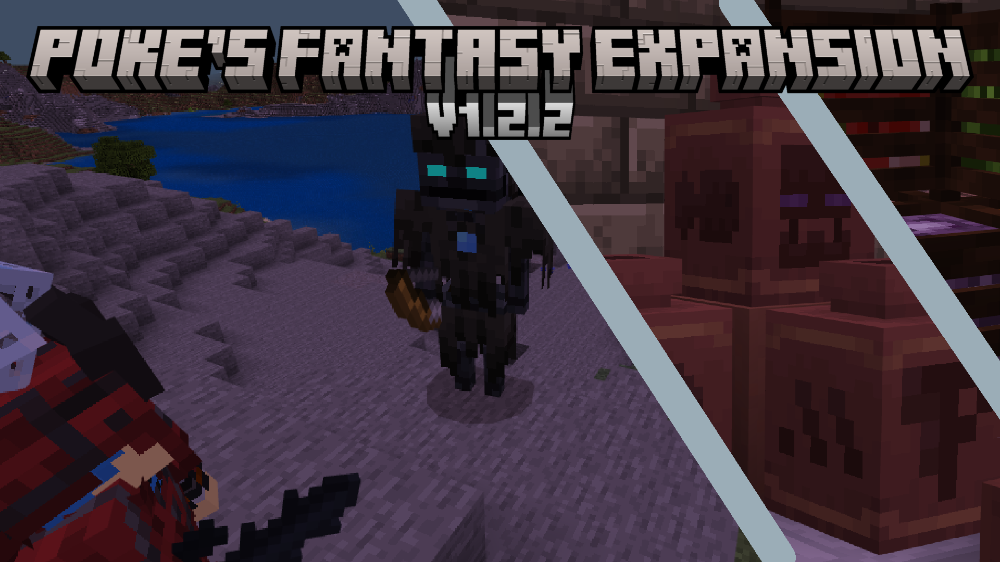

# v1.2.2

<figure><figcaption></figcaption></figure>


The Blocks only subpack was removed in this version. this has been changed to a different addon that can be found here: [blocks-v1.0.md](../pfe-split/blocks-v1.0.md "mention") or in the [Addon Archive repo in the PFE Split Section](https://github.com/ItsMePok/Addon-Archive/tree/main/PFE/PFE%20Split)


## v1.2.2


### No Experimental toggles are needed for this update

### This is for Minecraft Version: 1.21.20+&#x20;


### o/

##  **Items & Armor**

* Added Pickaxes
  * Emerald
  * Amethyst
  * Shade
  * Radium
  * Cobalt
  * Onyx
  * Holy
  * Hellish
  * Godly
  * Demonic
  * Medic
  * Molten
  * Galaxy
  * Void
  * Astral
  * Death
  * Nebula
    * Any feedback on these would be appreciated
* Added Radium Nugget
* Added Grilled Cheese
* Added Astral & Medic Scythe
* Added Pottery Sherds
  * Blank (Barrel in End Guard Tower)
  * Star (Shopkeeper Trade)
  * Knightling (Knightling Drop)
  * Cassette (Token Trader trade)
  * Storm (Vault in Ruined Tower)
  * Crowned (Cosmetic Trader Trade)
  * Fish (Brushing in Broken Conduit)
  * Poke (Barrel in End Guard Tower)
  * Modbay (Money man trade)
  * MCPEDL (Red Present Drop)
  * Curseforge (Scrapper trade)
  * GitHub (Sporecat Drop)
  * Ingot (Very rare drop from PFE ores)
  * Craft (Barrel in Broken Swampsite)
  * Snake (Brushing in Desert Vault)
  * Enderman (Sculk Enderman Drop)
  * Listener (Listener Drop)
  * Mushroom Buddy (Mushroom Buddy Drop)
  * Wizard (Barrel in Abandoned Ship)
  * Bee (Barrel in Grove Rock)
  * Spell (Crafted in Spell Crafter)
* Added Spells (Crafted in Spell Crafter)
  * Dodge Spell
    * Boosts you in the direction you are moving
  * Gravity Spell
    * Fires a Gravity Ball
  * Entities nearby will be pulled towards it,
  * Lasts for 20 seconds
  * Fireball Spell
    * Fires a Fireball
* Added Xp Vial
  * Grants 160 Xp (same amount as going from lvl 1->10)
* Added Empty Vial (Crafted in Spell Crafter)
  * Consumes 10 levels to give you an Xp Vial
* Craft Quests are no longer a WIP
* Added 7 Craft Quests
* Galaxy, Astral, Nebula's set bonus now gives Health Boost 3

##  **Blocks & Ores**

* Added Honey Tile Wall
* Added block face culling to the walls
* Walls that connect on all 4 sides now have a full block's collision & selection box
* Added Spell Crafter
* Added Magic 8 Ball (Crafted in Spell Crafter)
  * Will randomly say something when interacted with
* Added Shadowstone
  * Generates in the End
* Added Cobbled Shadowstone
* Added Polished Shadowstone
* Added Slabs
  * Shadowstone
  * Cobbled Shadowstone
  * Polished Shadowstone
* Added Walls:
  * Astral Brick
  * Cobalt Brick
  * Death Brick
  * Demonic Brick
  * Galaxy Brick
  * Godly Brick
  * Hellish Brick
  * Holy Brick
  * Medic Brick
  * Molten Brick
  * Nebula Brick
  * Onyx Brick
  * Radium Brick
  * Shade Brick
  * Void Brick
  * Honey Brick
  * Cobbled Shadowstone
  * Shadowstone
* Added several block tags to all blocks to improve compatibility with tools from other addons
* Limestone Brick Post will now connect to blocks when placed
* Crates will no longer conduct Redstone
* All Crates are now flammable

## **Mobs & Trades**

* Added Super Striker
  * Boss event only boss
* Sporecats now has a name tag variant
* Moved the 5 Currency Exchanging trades from the Shopkeeper to the Money Man
* Sporecats are now immune to fire/lava damage

##  **Recipes** 

* Cosmetic Trader can now be crafted
* Changed the recipe of
  * Block Breaker
  * Cobblestone Generator
  * Empty Crate

##  **Textures & Sounds**

* Retextured/Remodeled all the crates
* Retextured/Remodeled Swift Boots
* Retextured Snowman (Boss)
* Improved Burstbow & Crossbow animations
* Crossbows now have sounds
* Holy & Hellish's Chestplate are now the proper size
* Holy & Hellish Armor now fully supports Armor Trims
* Swift boots can now use Armor Trims
* Top hat now sits lower
* Added Whiskers to the Rats

## **Structures & Other** :question:

* Made Several addons containing specific parts of PFE (PFE Split)
  * Note: These might not be released to MCPEDL/Curseforge/ModBay (It is available on GitHub)
  * Note x2: This does not affect PFE in any way, its just separate packs for if you only want specific parts from PFE
  * Split:
    * Blocks
    * Upgraders
    * Raw Ore Block Smelting
    * Scythes
* Removed the Blocks Only subpack
  * To continue using this you will have to use the Blocks PFE Split addon
* Renamed:
  * Swift Pickaxe -> Quickaxe
  * Demonic Slasher -> Demonic Scythe
  * Charred\_poppy -> Charred Poppy
  * Cobalt Edged Glass -> Cobalt Glass
* Added Numbers to the quests

## **Balancing**

* Snowman (Boss) has had its hitbox size increased
* Reduced Zombken's Health \[200 -> 150]
* Reduced Zombken's Damage \[14 -> 8]
* The Listener no longer gives Darkness & Levitation
* Increased the Burstbow's charge time \[0s -> 0.25s]
* Burstbow's now launch the arrow based on how much the bow was drawn
* Adjusted damages:
  * Iron Scythe \[7 ->6]
  * Gold Scythe \[8 -6]
  * Emerald Scythe \[8 -7]
  * Diamond Scythe \[9 -8]
  * Cobalt Scythe \[8 -6]
  * Shade Scythe \[18 -9]
  * Radium Scythe \[24 -12]
  * Holy Scythe \[17 -14]
  * Godly Scythe \[21 -17]
  * Void Scythe \[27 -25]
  * Galactic Scythe \[30 -23]
* Adjusted durability:
  * Godly Scythe \[5700 -3200]
  * Radium Scythe \[5700 -2750]
  * Ember Scythe \[5700 -2875]
  * Demonic Scythe \[5500 -2700]
* Demonic Allays will now only spawn on:
  * Netherrack
  * Crimson Nylium
  * Basalt
  * Lava
  * Soul Sand
  * Soul Soil
  * Magma
  * Blackstone
  * Glowstone
* Demonic Allays no longer spawn in peaceful
* Increased Block Break times
  * Deepslate Ores \[1s / 1.25s -2s]
  * Stone Ores \[1s / 1.25s -1.5s]
  * Nether Ores \[1s -1.25s]
  * End Ores \[1s -2s]
* Changed the weight of boss event mobs
  * Zombken \[90 -75]

##  **Bug Fixes**

* Unbreaking is now considered when breaking blocks
* Cobalt Potion now works again
* Astral Boots are now in the Boots Category
* Fixed an issue where a few pixels on the Flow & Wild Armor Trims were not colored properly on the Robes
* Armor icons no will longer overwrite the icons of similarly name armors from other addons
* Death Boots have a texture again
* Fixed a bunch of potential compatibility issues
* Tamed mobs should no longer despawn
* Burstbows will not fire another arrow as soon as you interact with it
* Spawn eggs in survival cannot go into spawners again
  * this fix has broken the ability to dispense those eggs
* Quest will now complete properly
* Spawn eggs no longer have infinite uses
* Fixed an issue where some ores (in block form) would not smelt
* Made several changes to improve translation

## Download Link


