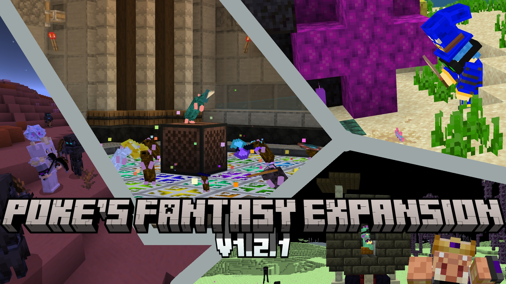
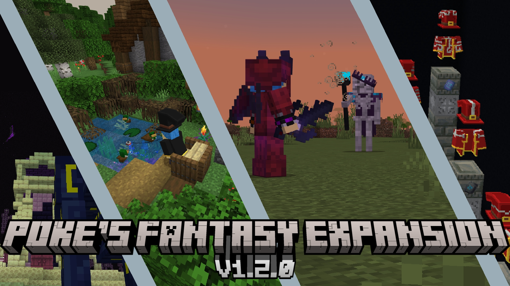
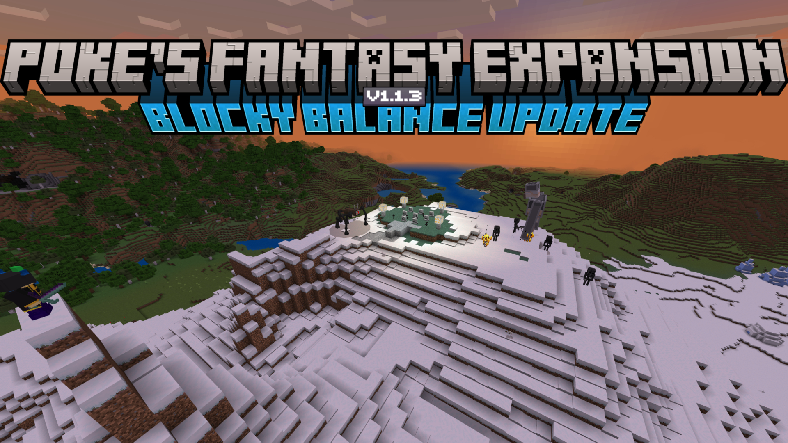
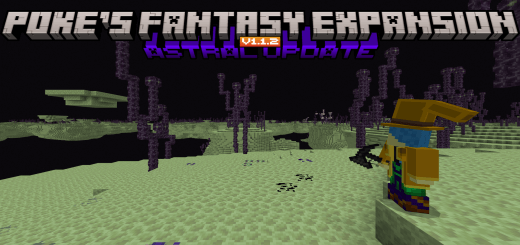
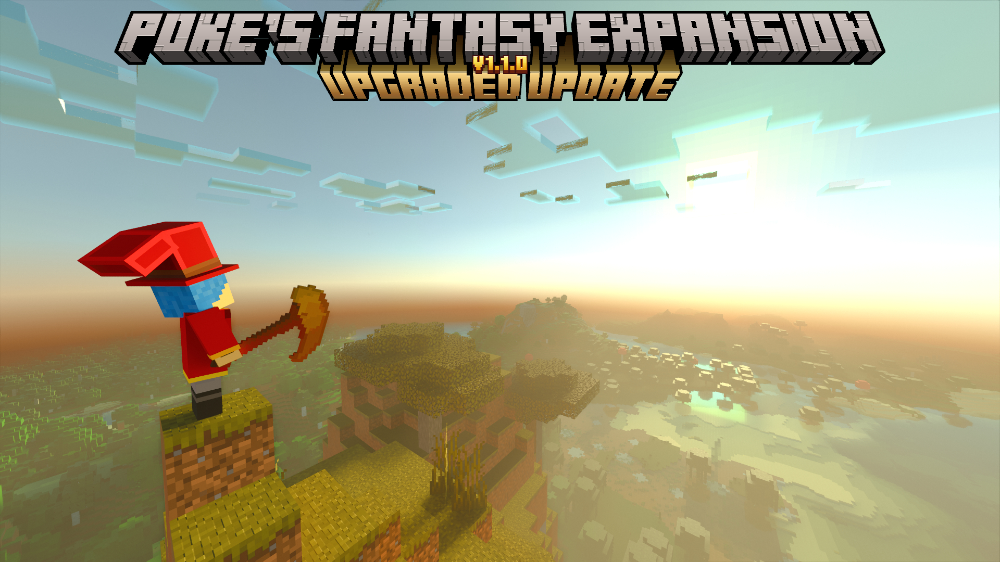
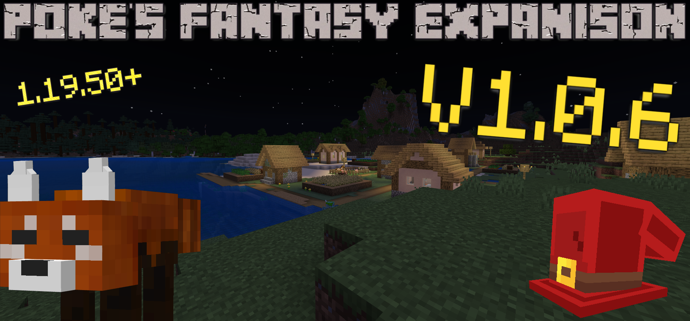
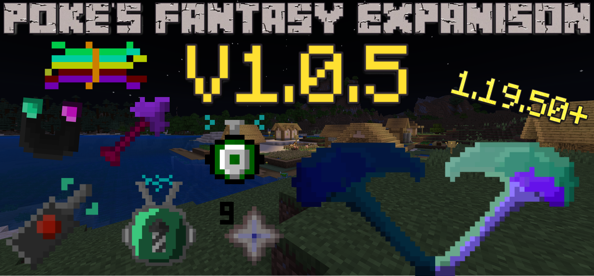
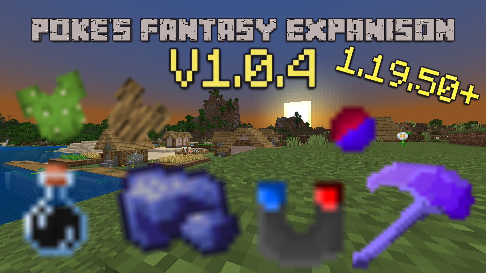
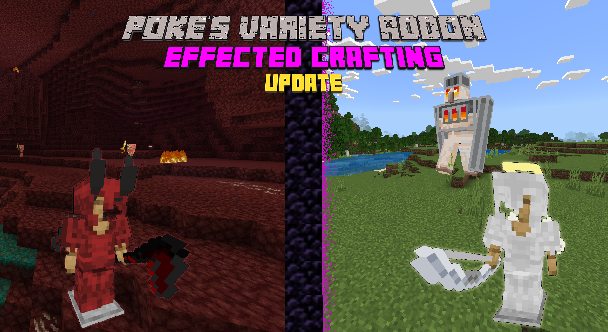

# Keyarts

<figure><figcaption>
1.2.1
</figcaption></figure>

<figure><figcaption>
1.2.0
</figcaption></figure>

<figure><figcaption>
1.1.9 (1.1.8 was merged into this)
</figcaption></figure>

<figure><figcaption>
1.1.7 (1.1.5 &#x26; 1.1.6 was merged into this)
</figcaption></figure>

<figure><figcaption>
1.1.4
</figcaption></figure>

<figure><figcaption>
1.1.3
</figcaption></figure>

<figure><figcaption>
1.1.2
</figcaption></figure>

<figure><figcaption>
1.1.1
</figcaption></figure>

<figure><figcaption>
1.1.0
</figcaption></figure>

<figure><figcaption>
1.0.9
</figcaption></figure>

<figure><figcaption>
1.0.8
</figcaption></figure>

1.0.7 - missing

<figure><figcaption>
1.0.6
</figcaption></figure>

<figure><figcaption>
1.0.5
</figcaption></figure>

<figure><figcaption>
1.0.4
</figcaption></figure>

1.0.3 - missing

<figure><figcaption>
1.0.2
</figcaption></figure>

1.0.1 - missing

1.0.0 - missing
