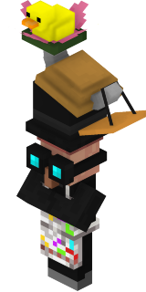

# Cosmetic Trader

<figure><figcaption></figcaption></figure>

##  Identifier: **poke:cosmetic\_trader** 

##  Trades:

| Wants                                                                                                                                                                            | Gives                                                                             |
| -------------------------------------------------------------------------------------------------------------------------------------------------------------------------------- | --------------------------------------------------------------------------------- |
| [Iron Token](../../items/currency/tokens/iron-token.md) | [Steampunk Hat](../../armor/cosmetics/offhand-cosmetics/steampunk-hat.md)         |
| [Iron Token](../../items/currency/tokens/iron-token.md) | [Crab Pal](../../armor/cosmetics/offhand-cosmetics/crab-pal.md)                   |
| [Iron Token](../../items/currency/tokens/iron-token.md) | [Ghost](../../armor/cosmetics/offhand-cosmetics/ghost.md)                         |
| [Iron Token](../../items/currency/tokens/iron-token.md) | [Ferret](../../armor/cosmetics/offhand-cosmetics/ferret.md)                       |
| [Iron Token](../../items/currency/tokens/iron-token.md) | [Mr. Duck](../../armor/cosmetics/offhand-cosmetics/mr.-duck.md)                   |
| [Iron Token](../../items/currency/tokens/iron-token.md) | [Apollo the Snake](../../armor/cosmetics/offhand-cosmetics/apollo-the-snake.md)   |
| [Iron Token](../../items/currency/tokens/iron-token.md) | [Maxwell](../../armor/cosmetics/offhand-cosmetics/maxwell.md)                     |
| [Iron Token](../../items/currency/tokens/iron-token.md) | [Caged Soul](../../armor/cosmetics/offhand-cosmetics/caged-soul.md)               |
| [Iron Token](../../items/currency/tokens/iron-token.md) | [Little Dapper Fit](../../armor/cosmetics/offhand-cosmetics/little-dapper-fit.md) |
| [Iron Token](../../items/currency/tokens/iron-token.md) | [Dapper Fit](../../armor/cosmetics/offhand-cosmetics/dapper-fit.md)               |
| [Iron Token](../../items/currency/tokens/iron-token.md) | [Big Dapper Fit](../../armor/cosmetics/offhand-cosmetics/big-dapper-fit.md)       |
| [Iron Token](../../items/currency/tokens/iron-token.md) | [MLG Glasses](../../armor/cosmetics/offhand-cosmetics/mlg-glasses.md)             |
| [Iron Token](../../items/currency/tokens/iron-token.md) | [Halo](../../armor/cosmetics/offhand-cosmetics/halo.md)                           |
| [Iron Token](../../items/currency/tokens/iron-token.md) | [Horns](../../armor/cosmetics/offhand-cosmetics/horns.md)                         |
| [Iron Token](../../items/currency/tokens/iron-token.md) | [Poppy Hat](../../armor/cosmetics/offhand-cosmetics/poppy-hat.md)                 |
| [Iron Token](../../items/currency/tokens/iron-token.md) | [Sword Hat](../../armor/cosmetics/offhand-cosmetics/sword-hat.md)                 |
| [Iron Token](../../items/currency/tokens/iron-token.md) | [Traffic Cone](../../armor/cosmetics/helmet-cosmetics/trafic-cone.md)             |
| [Iron Token](../../items/currency/tokens/iron-token.md) | [Flower Lilly](../../armor/cosmetics/helmet-cosmetics/flower-lilly.md)            |
| [Iron Token](../../items/currency/tokens/iron-token.md) | [Goggles](../../armor/cosmetics/helmet-cosmetics/goggles.md)                      |
| [Iron Token](../../items/currency/tokens/iron-token.md) | [Viking Helmet](../../armor/cosmetics/helmet-cosmetics/viking-helmet.md)          |
| [Iron Token](../../items/currency/tokens/iron-token.md) | [Cube](../../armor/cosmetics/chestplate-cosmetics/cube.md)                        |
| [Iron Token](../../items/currency/tokens/iron-token.md) | [Armadillo Shell](../../armor/cosmetics/helmet-cosmetics/armadillo-shell.md)      |
| [Iron Token](../../items/currency/tokens/iron-token.md) | [Pirate Hat](../../armor/cosmetics/helmet-cosmetics/pirate-hat.md)                |
| [Iron Token](../../items/currency/tokens/iron-token.md) | [Carved Melon Mask](../../armor/cosmetics/helmet-cosmetics/carved-melon-mask.md)  |
| [Iron Token](../../items/currency/tokens/iron-token.md) | [Grad Cap](../../armor/cosmetics/helmet-cosmetics/grad-cap.md)                    |
| [Iron Token](../../items/currency/tokens/iron-token.md) | [Festive Helmet](../../armor/cosmetics/helmet-cosmetics/festive-helmet.md)        |
| [Iron Token](../../items/currency/tokens/iron-token.md) | [Party Hat](../../armor/cosmetics/helmet-cosmetics/party-hat.md)                  |
| [Gold Token](../../items/currency/tokens/gold-token.md) | [Crowned Pottery Sherd](../../blocks/pottery-sherds/crowned-pottery-sherd.md)     |

## Obtaining:




<figure><figcaption>
Sold by the <a href="token-trader.md">Token Trader</a>
</figcaption></figure>

<table data-full-width="false"><thead><tr><th align="center">Wants</th><th width="88" align="center">Amount</th><th align="center">Gives</th><th width="85" align="center">Amount</th></tr></thead><tbody><tr><td align="center"><a href="../../items/currency/tokens/iron-token.md">Iron Token</a></td><td align="center">1</td><td align="center">  Cosmetic Trader Spawn Egg</td><td align="center">1</td></tr></tbody></table>


This spawn egg cannot be used in  [Spawners](https://minecraft.wiki/w/Monster_Spawner)





<figure><figcaption>
Dropped by the Cosmetic Trader
</figcaption></figure>

| Item                                                                                                                                                                     | Amount | Chance of Drop |
| ------------------------------------------------------------------------------------------------------------------------------------------------------------------------ | ------ | -------------- |
|   Cosmetic Trader Spawn Egg | 1      | 99.9%          |
| [Cosmetic Cosmetic](../../armor/cosmetics/helmet-cosmetics/cosmetic-cosmetic.md)                                                                                         | 1      | 0.01%          |


This spawn egg cannot be used in  [Spawners](https://minecraft.wiki/w/Monster_Spawner)



