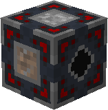

# Abandoned-Ship


The 3D Render above was not wanting to show some of the custom blocks, refer to the [In-Game Screenshots](abandoned-ship.md#in-game-screenshots) for a better image


## **Structure identifier:** poke:abandoned\_ship 

## Generation

* Generates in [The End](https://minecraft.wiki/w/The\_End#Biomes)


Structures will only generate in newly generated chunks.&#x20;

If you are using an older world you may need to explore further to find the Structures


## Loot:


A higher weight makes it more likely to be selected from that pool


### **Barrel:**

(3 of these ↓)

|                                                                                           Item                                                                                          |  #  | Weight |
| :-------------------------------------------------------------------------------------------------------------------------------------------------------------------------------------: | :-: | :----: |
|                                                                                      Cassette - Far                                                                                     |  1  |    1   |
|                                                                                     Cassette - Boss                                                                                     |  1  |    1   |
|                                                                                     End Crystal Hat                                                                                     |  1  |    1   |
| [Diamond Upgrade Core](../items/cores/diamond-upgrade-core.md) |  1  |    1   |
|                                                                                   Charged Cobalt Block                                                                                  |  1  |    1   |
|                                                                                   Night Vision Goggles                                                                                  |  1  |    1   |
|         [Upgrade Core](../items/cores/upgrade-core.md)         |  1  |    2   |
|                                                                                 Calibrated Block Breaker                                                                                |  1  |    2   |
|                                                                             Calibrated Cobblestone Generator                                                                            |  1  |    2   |
|                                                                                         Antenna                                                                                         |  1  |    3   |
|                                                                                          Empty                                                                                          |  -  |    4   |

(8-16 of these ↓)

<table><thead><tr><th align="center">Item</th><th data-type="number">#</th><th align="center">Weight</th></tr></thead><tbody><tr><td align="center"><a href="https://minecraft.wiki/w/Hopper">Hopper</a></td><td>1</td><td align="center">2</td></tr><tr><td align="center"><a href="https://minecraft.wiki/w/Block_of_Redstone">Redstone Block</a></td><td>1</td><td align="center">2</td></tr><tr><td align="center"><a href="../items/crafting-components/onyx-shaft.md">Onyx Shaft</a></td><td>1</td><td align="center">2</td></tr><tr><td align="center"><a href="../items/cores/magnet-core.md">Magnet Core</a></td><td>1</td><td align="center">2</td></tr><tr><td align="center"><a href="../blocks/automation/block-breaker.md"> Block Breaker</a></td><td>1</td><td align="center">2</td></tr><tr><td align="center"><a href="../blocks/automation/dirter.md"> Dirter</a></td><td>1</td><td align="center">2</td></tr><tr><td align="center"><a href="../blocks/automation/cobblestone-generator.md"> Cobblestone Generator</a></td><td>1</td><td align="center">2</td></tr><tr><td align="center"><a href="../blocks/automation/duster.md"> Duster</a></td><td>1</td><td align="center">2</td></tr><tr><td align="center"><a href="../items/crafting-components/red-button.md">Red Button</a></td><td>1</td><td align="center">2</td></tr><tr><td align="center"><a href="https://minecraft.wiki/w/Redstone_Comparator"> Comparator</a></td><td>1</td><td align="center">2</td></tr><tr><td align="center"><a href="../items/crafting-components/receiver.md">Receiver</a></td><td>1</td><td align="center">2</td></tr><tr><td align="center"><a href="../items/crafting-components/gps-module.md">GPS Module</a></td><td>1</td><td align="center">3</td></tr><tr><td align="center"><a href="https://minecraft.wiki/w/Daylight_Detector">Daylight Detector</a></td><td>1</td><td align="center">3</td></tr><tr><td align="center"><a href="https://minecraft.wiki/w/Sticky_Piston"> Sticky Piston</a></td><td>1</td><td align="center">3</td></tr><tr><td align="center"><a href="../items/ingots/cobalt-ingot.md"> Cobalt Ingot</a></td><td>1</td><td align="center">3</td></tr><tr><td align="center"><a href="https://minecraft.wiki/w/Observer"> Observer</a></td><td>1</td><td align="center">5</td></tr><tr><td align="center"><a href="https://minecraft.wiki/w/Piston"> Piston</a></td><td>1</td><td align="center">5</td></tr><tr><td align="center"><a href="https://minecraft.wiki/w/Redstone_Dust">Redstone Dust</a></td><td>1</td><td align="center">5</td></tr><tr><td align="center"><a href="../items/crafting-components/electric-component.md"> Electric Component</a></td><td>1</td><td align="center">5</td></tr><tr><td align="center"><a href="../items/crafting-components/wire.md">Wire</a></td><td>1</td><td align="center">6</td></tr><tr><td align="center"><a href="../items/banished-stars/banished-star.md"> Banished Star</a></td><td>1</td><td align="center">6</td></tr><tr><td align="center"><a href="../items/crafting-components/plastic.md">Plastic</a></td><td>1</td><td align="center">6</td></tr><tr><td align="center">Empty</td><td>0</td><td align="center">15</td></tr></tbody></table>

(5 of these ↓)

<table><thead><tr><th align="center">Item</th><th data-type="number">#</th><th align="center">Weight</th></tr></thead><tbody><tr><td align="center"><a href="../items/tokens/diamond-token.md">Diamond Token</a></td><td>1</td><td align="center">1</td></tr><tr><td align="center"><a href="../items/tokens/gold-token.md">Gold Token</a></td><td>1</td><td align="center">5</td></tr><tr><td align="center"><a href="../items/tokens/copper-token.md">Copper Token</a></td><td>1</td><td align="center">10</td></tr><tr><td align="center"><a href="../items/tokens/iron-token.md">Iron Token</a></td><td>1</td><td align="center">15</td></tr><tr><td align="center">Empty</td><td>0</td><td align="center">10</td></tr></tbody></table>

***

## In-game Screenshots:

